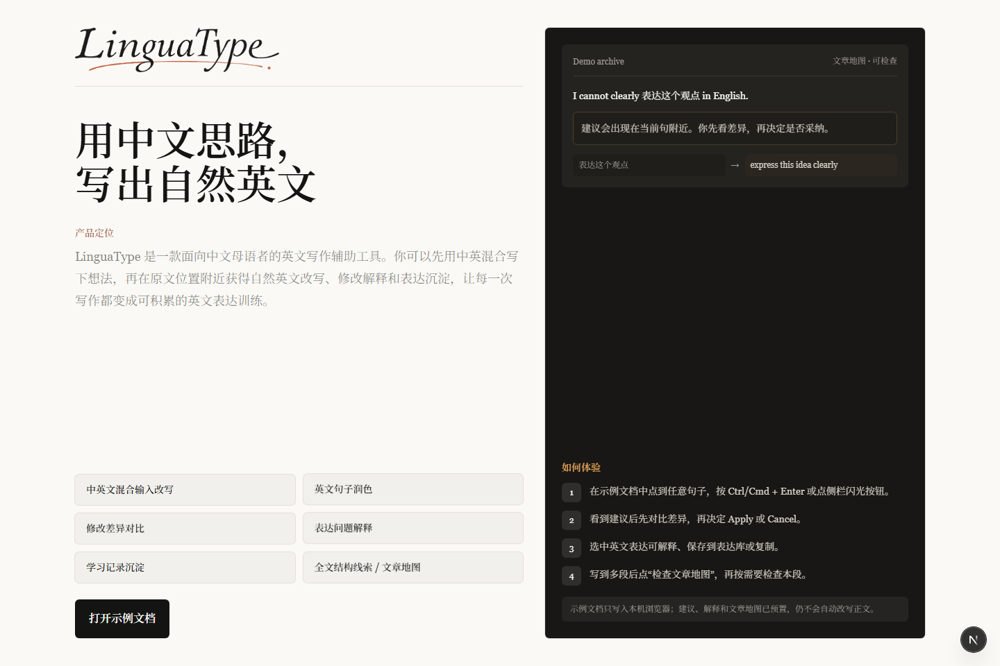
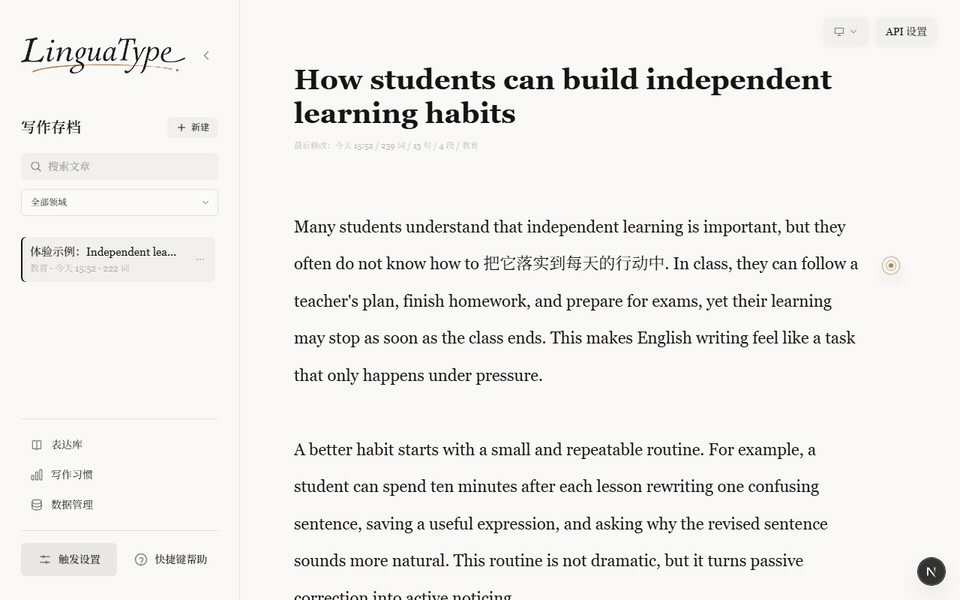
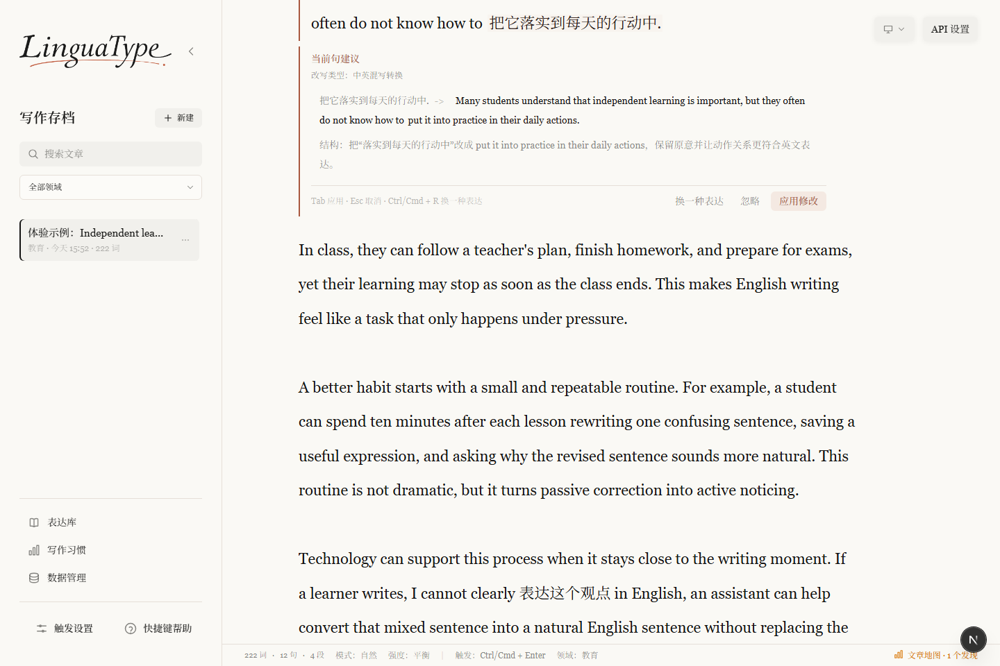
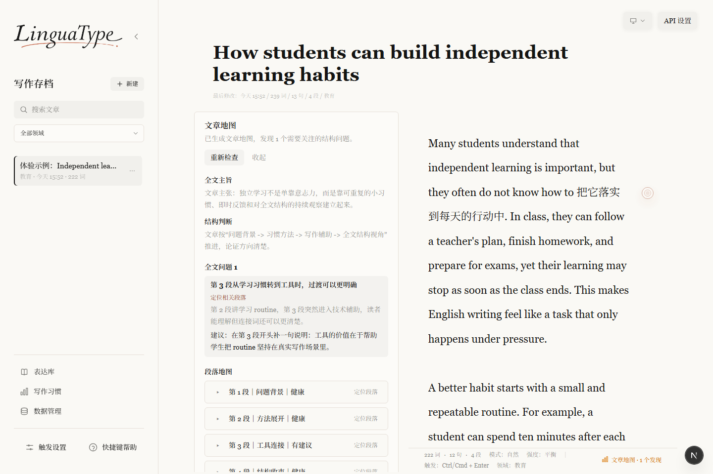
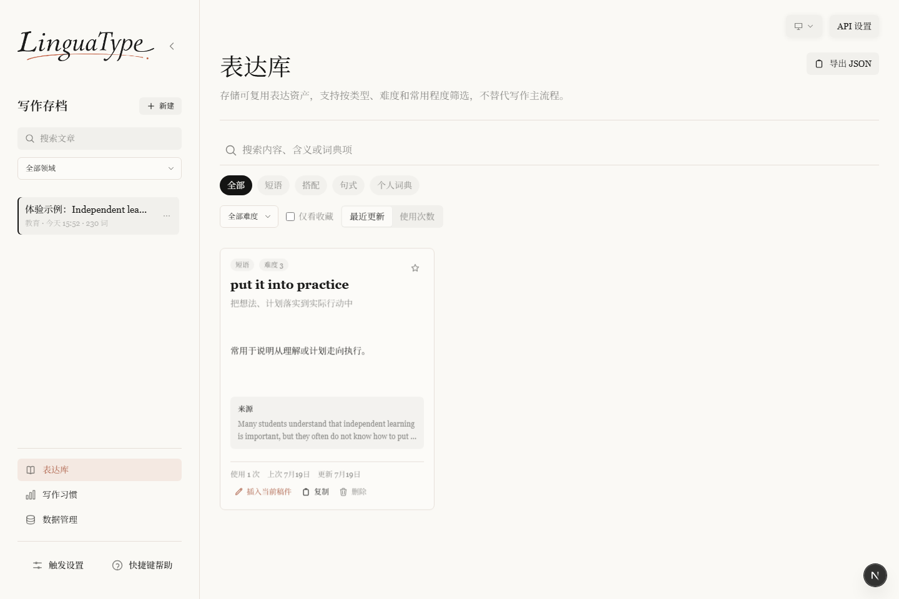

<div align="center">
  
  <h3>把中文思路，写成你自己的英文</h3>
  <p>面向中文母语英语学习者的输入法式英文表达助手。</p>
  <p>
    <a href="https://lingua-type.vercel.app/"><strong>在线体验</strong></a>
    ·
    <a href="#本地运行">本地运行</a>
    ·
    <a href="#产品边界">产品边界</a>
  </p>
</div>



## 你缺的不是另一台写作机器

你已经知道自己想说什么，只是英文没有及时跟上：一句话写到一半卡住，于是先夹一段中文；改完以后知道句子“更对了”，却不知道为什么；写到第三、第四段时，又开始看不清整篇文章是否还围绕同一个主旨。

大多数工具会把你带离正在写的地方——复制文本、打开对话框、描述需求，再把生成结果贴回来。LinguaType 选择留在写作现场：理解光标附近的当前句，在原位给出建议和差异，把是否应用的决定留给你。

例如，你可以直接写：

> This may 影响 young people's values.

然后继续思考，而不是先停下来寻找一个完美译法。

## LinguaType 为谁而做

它适合这些中文母语的英文写作者：

- 正在写英文课程作业、论文段落、申请材料或工作文本，希望保留自己观点的人
- 习惯先用中文形成思路，再逐步组织成英文的人
- 不只想得到“正确答案”，也想理解表达为什么更自然的人
- 希望把每次采纳的表达与反复出现的写作问题沉淀下来的人

如果你要的是一键生成整篇作文、全文批改、作文评分或自动续写，LinguaType 并不适合。它服务的是“我来写，工具在需要时扶我一下”。

## 一次完整的写作体验



从一句中英混写开始，LinguaType 的工作方式是：

1. 只捕捉光标所在的当前句，不接管整段文字。
2. 把所有中文片段转换成自然英文，并对已有英文做轻量润色。
3. 在原文附近展示代码生成的差异和中文解释。
4. 只有你点击“应用修改”后，才替换被捕捉的句子范围。
5. 应用后再把可复用表达和修改信号沉淀到本地学习数据中。

建议不是命令。你可以应用、忽略、换一种表达或复制结果；编辑器内容发生变化时，LinguaType 会阻止旧建议覆盖新文本。

## 从一句话，到整篇文章

LinguaType 不把正文拆成卡片，也不把写作变成与 AI 的聊天。正文始终是一块连续、稳定的长文本写作面；帮助则按你当前所处的层级出现。

### 当前句：卡住时继续写



中英混写不是错误，而是思路尚未找到英文出口时的临时占位。LinguaType 在完整句子稳定后才准备建议，尽量不打断正在发生的输入。

### 全文：看清结构，而不是让 AI 重写



文章地图把全文主旨、结构判断、段落角色、段落关系和优先修改建议放在正文旁边。它帮助你决定“下一步先看哪里”，但不会生成全文改写，也不会给作文打分。

### 长期：把修改变成自己的表达资产



只有明确采纳的句子建议，或主动保存的选中表达，才会进入本地表达库。相同表达会去重并累计使用次数；写作习惯则从已采纳的 Correction Events 中聚合，而不是展示一串原始错误日志。

## 产品取舍

LinguaType 的设计围绕几条克制的原则展开：

- **靠近写作现场**：高频建议出现在编辑器和当前句附近，低频管理收进侧边入口。
- **建议，不接管**：模型输出永不自动应用，不替用户生成论点或决定写作方向。
- **连续写作优先**：正文保持一个原生长文本表面，优先保证光标、选区、输入法和追加输入稳定。
- **从修改中学习**：只有明确采纳后才提取学习数据，让表达库代表真实使用，而不是模型推荐列表。
- **本地优先**：写作存档、表达库、写作习惯和偏好设置都保存在浏览器 `localStorage`。

## 当前能力

- 中英文混合当前句转换
- 纯英文轻量润色，允许原句保持不变
- 原位差异对比、中文解释、应用 / 忽略 / 换一种表达 / 复制
- 当前段落的手动流畅度与细节检查
- 全文文章地图与安静的自动预检查
- 本地写作存档、表达库、写作习惯与表达复现提示
- 选中文本解释、保存到表达库和复制
- 浅色、深色与跟随系统主题
- OpenAI-compatible provider 与确定性的 Mock Mode

## 数据与隐私

- 写作存档和学习数据仅保存在当前浏览器，不包含账号、数据库或云同步。
- 如果你在 `API 设置` 中填写个人 API key，它会随其他设置保存在当前浏览器 `localStorage`，并仅在请求时发送给 Next.js API Route；请勿在公共设备上保存个人 key。
- 公开体验版通过服务端环境变量调用模型，访客无需填写 API key；服务端 key 不会下发到前端。
- 模型建议不会自动替换正文；学习数据只在明确应用或主动保存后写入本地。
- 文章地图和段落检查不会触发表达学习提取，也不会自动改写全文。

## 产品边界

LinguaType 不是通用翻译器、聊天机器人、作文生成器、全文批改器或作文评分工具，也不是系统级输入法或 Chrome 扩展。

它不会：

- 自动生成、续写或重写整篇文章
- 替用户决定论点和写作方向
- 自动应用句子、段落或全文修改
- 提供登录、云同步、支付或社交能力
- 把用户写作数据上传成云端学习档案

## 本地运行

环境要求：Node.js 18.18+。

```bash
npm install
npm run dev
```

打开 [http://localhost:3000](http://localhost:3000)。首次进入可以直接打开预置示例文档；Mock Mode 不依赖 Base URL、API key 或模型名。

常用检查：

```bash
npm run lint
npm test
npm run build
```

## 配置模型

项目通过统一 provider service 调用 OpenAI-compatible API，产品逻辑不会直接调用供应商接口。本地使用时可以在界面的 `API 设置` 中填写配置；公开部署建议把真实 key 放在 Vercel Project Settings 中，并参考 [`.env.example`](./.env.example)：

```env
NEXT_PUBLIC_LINGUATYPE_DEMO_API_ENABLED=true
LINGUATYPE_API_PROVIDER=openai-compatible
LINGUATYPE_API_BASE_URL=https://api.openai.com
LINGUATYPE_API_ENDPOINT_PATH=/v1/chat/completions
LINGUATYPE_API_MODEL=你的模型名
LINGUATYPE_API_KEY=你的真实 API key
LINGUATYPE_API_TEMPERATURE=0.2
LINGUATYPE_API_MAX_TOKENS=20000
LINGUATYPE_API_SUPPORTS_JSON_MODE=false
```

仓库不会保存真实 API key。使用其他 OpenAI-compatible 服务时，只需替换对应的 Base URL、endpoint path 与模型名。

## 了解项目

- [`PRODUCT.md`](./PRODUCT.md)：产品定位、当前范围与非目标
- [`ARCHITECTURE.md`](./ARCHITECTURE.md)：应用分层、数据流、存储与 provider 抽象
- [`MODULES.md`](./MODULES.md)：模块职责、文件映射与依赖边界
- [`CHANGELOG.md`](./CHANGELOG.md)：版本演进记录

---

<div align="center">
  <strong>LinguaType</strong><br />
  让工具帮助你表达，而不是替你写作。
</div>
